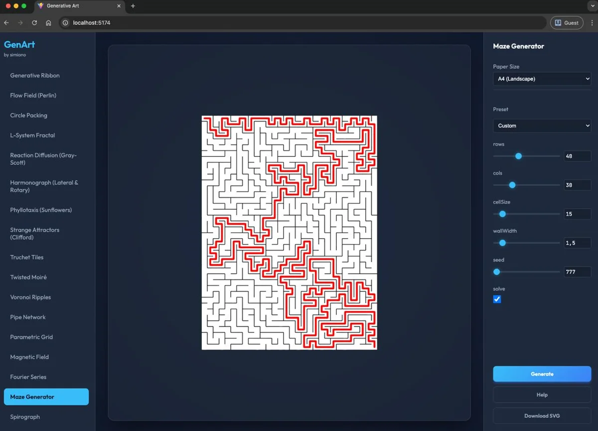
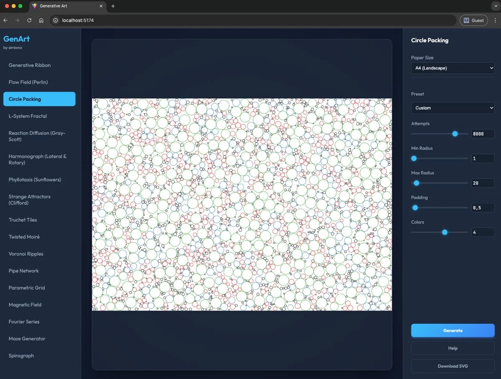
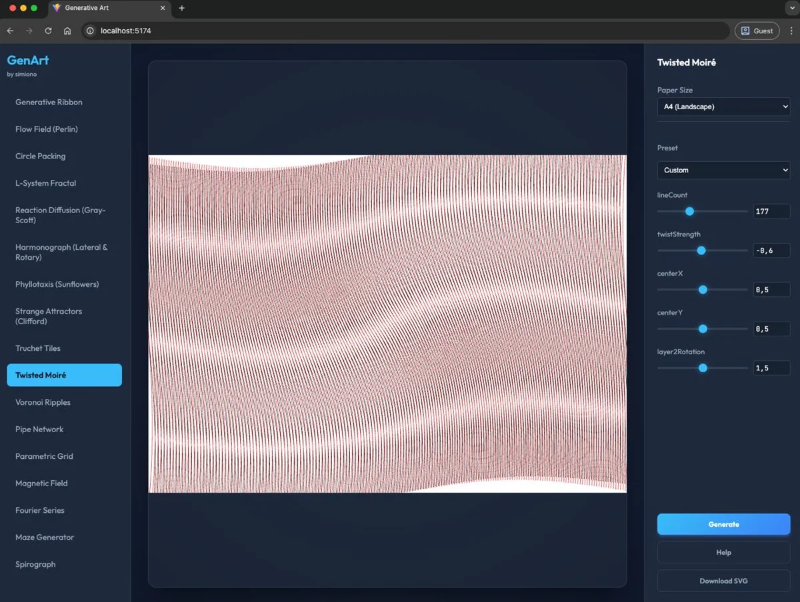
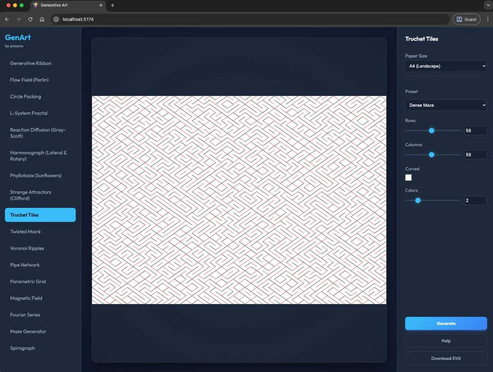
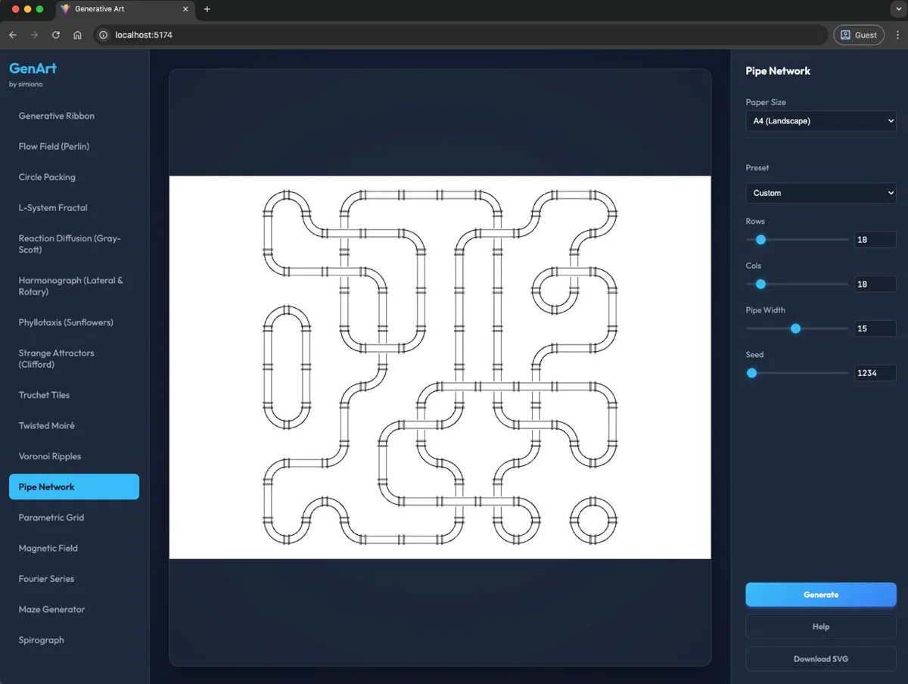

# Generative Art Framework

**Repository:** [https://github.com/utrost/GenerativeArt](https://github.com/utrost/GenerativeArt)

**Live Demo:** [utrost.github.io/GenerativeArt](https://utrost.github.io/GenerativeArt/) · [simiono.com/genart](https://simiono.com/genart/)

A browser-based framework for creating generative SVG art, tuned for pen plotters such as iDraw/Axidraw-style machines. The project is now **web-only**: Vite, vanilla JavaScript, SVG preview, and one-click SVG export.

The former Java/Swing application has been retired to keep the generator code in one place.

---

## Available Generators

The framework currently includes **33 generative algorithms**:

1. **Generative Ribbon**: Lofted 3D twisted ribbons using Moiré interference patterns.
2. **Flow Fields (Perlin)**: Particle systems steered by noise fields for organic textures.
3. **L-System Fractal**: Rule-based recursive fractals, such as dragon curves and ferns.
4. **Reaction Diffusion**: Biological pattern formation using a Gray-Scott model.
5. **Harmonograph**: Multi-pendulum mechanical drawing curves.
6. **Phyllotaxis**: Sunflower-like spirals using the golden angle.
7. **Strange Attractors**: Chaotic mathematical systems such as Clifford attractors.
8. **Circle Packing**: Space-filling non-overlapping circles.
9. **Truchet Tiles**: Maze-like geometric tessellations.
10. **Twisted Moiré**: Interference patterns from overlapping distorted grids.
11. **Voronoi Ripples**: Concentric clipping patterns inside Voronoi cells.
12. **Pipe Network**: Industrial pipe systems generated via Wave Function Collapse.
13. **Parametric Grid**: Ordered grids that decay into chaos.
14. **Magnetic Field**: Particle trajectories influenced by magnetic poles.
15. **Fourier Series**: Visualizations of wave summation.
16. **Maze Generator**: Perfect solvable mazes using recursive backtracking.
17. **Spirograph**: Epicycloid and hypocycloid curves.
18. **Penrose Tiling**: Aperiodic kite-and-dart tilings with five-fold symmetry.
19. **Wave Interference**: Overlapping circular wave patterns from multiple sources.
20. **Chladni Patterns**: Resonance patterns on vibrating plates.
21. **Celtic Knot**: Interlaced knotwork patterns inspired by Celtic art traditions.
22. **Contour Map**: Topographic contour lines from procedural noise landscapes.
23. **Capsule Interference**: Overlapping rounded-rectangle contour stacks for plotter studies.
24. **Folded Crystal**: Faceted polygon clusters with clipped hatch shading and plotter-native shadows.
25. **Crumpled Mesh**: Warped wireframe relief sheets inspired by technical-pen plotter studies.
26. **Fault Lines**: Geological contour fields sheared by tectonic cracks and stress ticks.
27. **Thread Loom**: Sagging thread curves woven between edge anchors through invisible fields.
28. **Botanical Circuit**: Plant-like branching constrained by PCB-style routing, pads, and vias.
29. **Botanical Gesture**: Loose flower, branch, and tree sketches made from repeated pen gestures.
30. **Paper Memory**: Recent and ghost paper creases with sparse rubbing marks.
31. **Mechanical Rain**: Falling trajectories deflected by pins, paddles, wind, and splash marks.
32. **Archive Shards**: Fragmented document rectangles clustered by hidden metadata axes and links.
33. **Resonant Topography**: Topographic contours broken by standing-wave resonance nodes.

---

## Gallery

<table>
  <tr>
    <td align="center"><br><b>Maze Generator</b><br>Solvable mazes with solution path</td>
    <td align="center"><br><b>Circle Packing</b><br>Space-filling non-overlapping circles</td>
  </tr>
  <tr>
    <td align="center"><br><b>Twisted Moiré</b><br>Interference patterns from distorted grids</td>
    <td align="center"><br><b>Truchet Tiles</b><br>Geometric maze-like tessellations</td>
  </tr>
  <tr>
    <td align="center"><br><b>Pipe Network</b><br>Industrial pipes via Wave Function Collapse</td>
    <td align="center"><em>+ more generators in the <a href="https://utrost.github.io/GenerativeArt/">Live Demo</a></em></td>
  </tr>
</table>

---

## Web Application

### Prerequisites

- **Node.js** v18 or newer recommended.
- **npm**.

### Installation

```bash
git clone https://github.com/utrost/GenerativeArt.git
cd GenerativeArt/web
npm install
```

### Run locally

From the repository root:

```bash
./start_web.sh
```

Or manually:

```bash
cd web
npm run dev
```

Vite will print the local URL, usually `http://localhost:5173`.

### Build for production

From the repository root:

```bash
./build.sh
```

Or manually:

```bash
cd web
npm run build
```

The static output is written to `web/dist/`.

### Generator library

The app uses a shared generator registry for desktop and mobile selection. Search matches generator names, tags, categories, and descriptions. Category chips narrow the library by visual family, while **Favorites** and **Recent** are stored locally in the browser so frequently used plotter studies stay close at hand. Desktop shows the library in the left sidebar; mobile opens the same library as a searchable bottom sheet instead of a long native dropdown.

Useful controls:

- **Search:** find by terms such as `plotter`, `contour`, `metadata`, `thread`, or `resonance`.
- **Categories:** switch between line fields, geometry, organic systems, math/physics, constructed systems, and plotter studies.
- **Favorites:** star generators to pin them near the top.
- **Recent:** the last selected generators are kept for quick return.
- **Random from filter:** choose a random generator from the current search/category result.

---

## Testing

```bash
cd web
npm test
```

Tests cover:

- Core SVG utilities.
- Paper-size handling.
- Parameter definitions.
- Seeded randomness.
- All generator IDs, display names, parameter definitions, numeric ranges, and SVG output.

---

## Plotter Notes

The application is designed around SVG output for pen plotters:

- **Layering:** generators can emit separate SVG groups such as `layer_1`, `layer_2`, etc. for pen changes.
- **Clean paths:** output favors simple SVG lines and paths rather than raster effects.
- **Paper sizes:** A4, A3, and Letter sizes are available in portrait and landscape.
- **Export:** use the web UI download button to save an SVG for plotting or post-processing with tools such as `vpype`.

---

## License

Copyright © 2025–2026 Uwe Trostheide

Licensed under the [GNU Affero General Public License v3.0](LICENSE).
