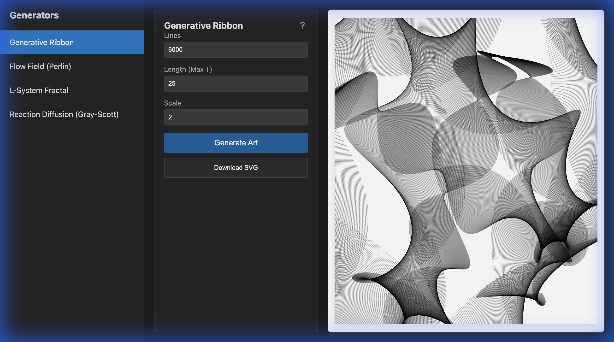
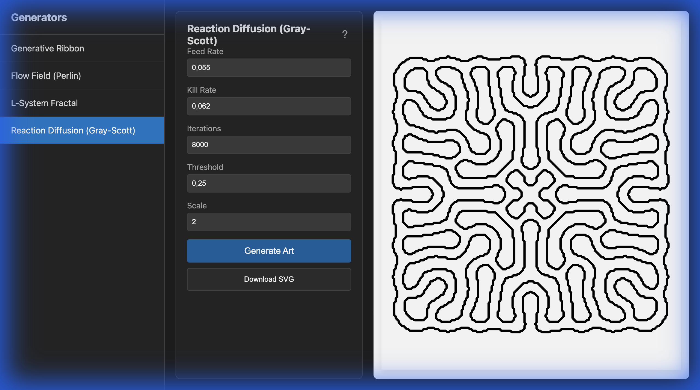

# Generative Art Control Center

A lightweight, dependency-free Java framework for creating generative art, specifically optimized for pen plotters (e.g., Axidraw). This project features an extensible plugin architecture and a local web-based UI for real-time parameter tuning and SVG generation.

## 🚀 Quick Start

1.  **Run the Application:**
    ```bash
    ./run.sh
    ```
    This script compiles the Java source and starts the local web server.

2.  **Open the Web UI:**
    Navigate to [http://localhost:8080](http://localhost:8080) in your browser.

3.  **Generate Art:**
    *   Select an algorithm from the sidebar (e.g., "Generative Ribbon").
    *   Adjust parameters (Density, Scale, etc.) in the control panel.
    *   Click **"Generate Art"** to see the preview.
    *   The SVG output is rendered in the browser (and can be saved/copied).

## 🖼 Screenshots

| Generative Ribbon | Reaction Diffusion |
| :---: | :---: |
|  |  |

## 🏗 Architecture

The project is built with a focus on simplicity and zero external dependencies (no Maven/Gradle required for core execution, standard JDK libraries only).

### Core Components

*   **`ArtGenerator` Interface** (`core/ArtGenerator.java`):
    The contract that all algorithms must implement. It defines:
    *   `getId()` / `getDisplayName()`: Identity.
    *   `getParameterDefinitions()`: Describes adjustable parameters (Type, Min/Max, Defaults) for the UI.
    *   `generate(Map params)`: The logic that accepts user inputs and returns an SVG string.

*   **`GeneratorRegistry`** (`core/GeneratorRegistry.java`):
    A simple registry where active generators are registered at startup.

*   **`WebServer`** (`app/WebServer.java`):
    A lightweight HTTP server (using `com.sun.net.httpserver`) that serves the static frontend and handles JSON API requests (`/api/generate`).

*   **Frontend** (`resources/web/index.html`):
    A single-page HTML/JS application that queries the registry to dynamically build forms for whatever generators are available.

## 🎨 Available Generators

### 1. Generative Ribbon (`GenerativeRibbon.java`)
Creates "lofted" 3D twisted ribbons using Moiré interference patterns.
*   **Parameters:** Line Density, Length, Scale.

### 2. Flow Fields (`FlowFieldGenerator.java`)
Uses Perlin Noise to guide thousands of particles across the canvas, creating organic, fluid-like textures.
*   **Parameters:** Noise Scale, Step Length, Max Steps, Seed.

## 🛠 Extending the Framework

To add a new art algorithm:

1.  **Create a Class** that implements `org.trostheide.generativeart.core.ArtGenerator`.
2.  **Implement Methods**:
    *   Define your parameters using `ParameterDefinition.integer()`, `doubleVal()`, etc.
    *   Write the `generate()` method to construct an SVG string based on those parameters.
3.  **Register It**:
    Add your new class to `src/main/java/org/trostheide/generativeart/app/App.java`:
    ```java
    GeneratorRegistry.register(new MyNewAlgorithm());
    ```
4.  **Recompile**: Run `./run.sh` again. The new algorithm will automatically appear in the Web UI.
